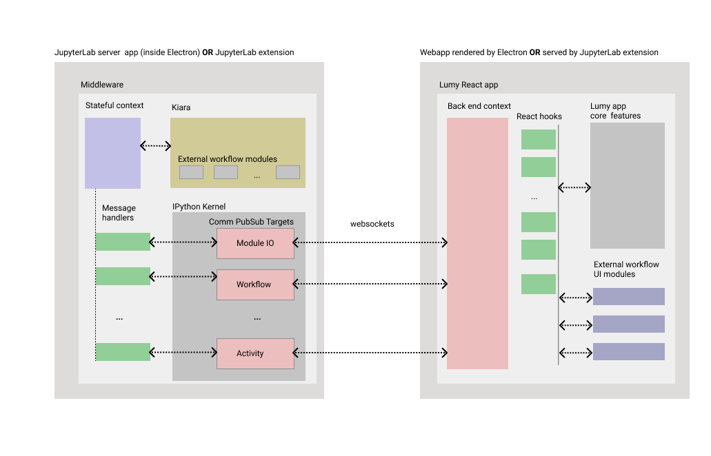

# Lumy architecture

## Table of contents

- [Middleware](#middleware)
  - [JupyterLab server app](#jupyterlab-server-app)
  - [JupyterLab extension](#jupyterlab-extension)
  - [Major parts](#major-parts)
- [Web App](#web-app)

Lumy app consists of two parts:

- the server side part (`middleware`) - a Python process
- the front end part (`webapp`) - a web application

## Middleware

The middleware code is located in a [separate repository](https://github.com/DHARPA-Project/lumy-middleware). It is distributed as a Python package and is technically not a standalone app - it needs an `IPython` aware container to be executed.

We provide two containers that can run the middleware:

### JupyterLab server app

A [JupyterLab server app](https://github.com/jupyterlab/jupyterlab_server). In this scenario the middleware runs within a [JupyterLab](https://jupyterlab.readthedocs.io/en/stable/) instance with all the standard extensions stripped down: menus, side panel, notebooks, etc. JupyterLab still provides all the infrastructure and Python kernel management that the middleware needs. The startup script for the JupyterLab server app is in this repository: [applications/jupyter-app/src/server/main.py](../applications/jupyter-app/src/server/main.py).

The Lumy desktop app powered by Electron starts this JupyterLab app as a subprocess on startup and shuts it down when it exits.

### JupyterLab extension

A standard [JupyterLab](https://jupyterlab.readthedocs.io/en/stable/) environment is a collection of extensions. Lumy middleware together with the front end code can be packaged as an extension and installed in JupyterLab. Lumy can then be launched from the default launch panel.

Code for the Lumy JupyterLab extension can be found under [applications/jupyterlab-extension](../applications/jupyterlab-extension).

### Major parts

The main mean of communication with the extension is a set of pub/sub channels. The channels are managed by IPython kernel where they are called `comm targets` or `comms`. [This page](https://jupyter-notebook.readthedocs.io/en/stable/comms.html) provides a short overview of how to use them. Channels have the same traits as any other pub/sub system: it's possible to publish a message on the channel and it's possible to subscribe to the channel. When a message is published, all the subscribers are notified. JupyterLab provides a websockets transport layer for the pub/sub channels which is fully managed by JupyterLab Python and JavaScript libraries.

Messages in Lumy are simple JSON objects. There is an [envelope](https://jupyter-client.readthedocs.io/en/latest/messaging.html#comm-messages) provided by IPython kernel comm target layer. The message body is a [Lumy envelope](../packages/client-core/src/common/types/base.ts) that contains `action` (the name of the message) and its `content`. The `content` of the message depends on the action. All contents are defined as JSON schemas and can be found in [schema/json/messages](../schema/json/messages), one directory per channel, one file per action.

The middleware defines `message handler` classes, one class per pub/sub target. Classes contain a set of functions, one function per action. When a message with a certain action is published on a target, the respective function is called with the message body as an argument.

Message handlers have access to `context`, which is just an object containing the instance of the pub/sub publisher, kiara instance and current kiara workflow. The context is kept in memory and is available during the lifetime of the process.

## Web App

Lumy webapp is built with the use of React framework. At the top level of the app is a [BackEndContextProvider](../packages/client-core/src/common/context.ts).

There are two implementations of the back end context provider for:

- Middleware backend
- Sandboxed backend

The [middleware backend](../packages/jupyter-support/src/kernelContext.ts) context contains all the objects and references needed to set up and use the websockets created by the middleware. The websockets management is abstracted by JupyterLab client libraries.

The [sandbox backend](../packages/module-sandbox/src/backEndContext/sandbox/index.ts) is used during development of the app and development of workflow UI modules.

The rest of the app should not access the context directly. Instead, a set of convenient [react hooks](../packages/client-core/src/hooks) is provided that serve as an abstraction layer for the context.

The UI part of the app has two layers:

- the core features layer which contains all the business logic and UI elements that provide the core features: list of workflows, workflow loading, notes and data rendering as well as a container for the workflow pages.
- workflow UI modules that are rendered in the workflow container provided by the app.

The core features code is bundled with the app and is mostly located in [client-ui package](../packages/client-ui). The UI modules code is dynamically loaded into the app when a workflow is launched. This code is not included in Lumy app. Instead, it is distributed as python packages which are referenced in the workflow file. Lumy middleware takes care of installing these dependencies. The middleware also provides this code to the frontend which executes it and makes it available to the app. For more information about workflow UI modules see documentation in the [modules package](../packages/modules).
